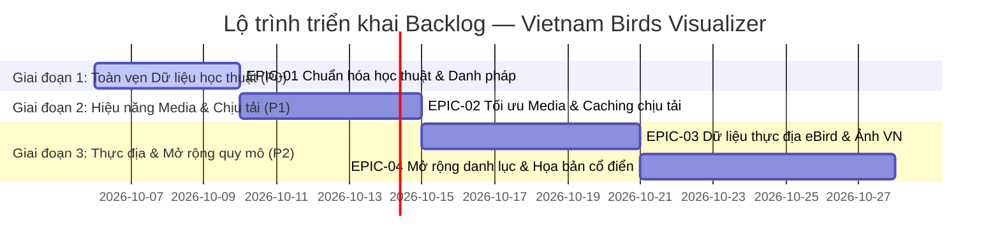

# Product Backlog: Vietnam Birds Visualizer

Tài liệu quản lý danh mục tính năng, cải tiến kỹ thuật, dữ liệu và hiệu năng dành cho dự án **Vietnam Birds Visualizer**.

---

## 1. Bảng tổng quan Backlog tinh gọn

### Các hạng mục đang thực hiện (Active Epics)

| Mã Epic | Hạng mục công việc trọng tâm | Các task cũ gộp vào | Phân loại | Ưu tiên | Trạng thái |
| :--- | :--- | :--- | :--- | :---: | :---: |
| **EPIC-01** | **Toàn vẹn & Chính xác dữ liệu học thuật** (Sửa link IUCN 404, Avibase ID, Tên địa phương & Synonyms) | BL-05, BL-15 | Data Integrity | **P0** | 📝 In Planning |
| **EPIC-02** | **Tối ưu truyền tải Media & Bộ nhớ đệm chịu tải** (Audio Cache, CDN ảnh, Lazy Load Tab) | BL-13, BL-14, BL-16 | Performance / Infra | **P1** | 📝 In Progress |
| **EPIC-03** | **Tích hợp dữ liệu thực địa & Cộng đồng** (eBird API Key, Tọa độ quan sát mới, Kho ảnh chụp tại VN) | BL-03, BL-06 | GIS / Citizen Science | **P2** | 💡 Backlog |
| **EPIC-04** | **Mở rộng danh lục toàn diện & Họa bản cổ điển** (Batch pipeline mở rộng loài, Họa bản BHL/Delacour) | BL-04, BL-12 | Scale / Curation | **P2** | 💡 Proposed |
| **EPIC-05** | **Tái cấu trúc kiến trúc MapView (Headless Domain Core + Adaptive View Presenters)** (Tách `shared/`, `desktop/`, `mobile/` độc lập) | Arch Refactor | Architecture | **P1** | 💡 Proposed |

---

### Các tính năng đã hoàn thành (Shipped & Verified)

| Mã cũ | Tên tính năng đã bàn giao | Phân loại | Trạng thái |
| :--- | :--- | :--- | :---: |
| **BL-01** | Khắc phục sự cố không thể zoom trên bản đồ Leaflet | GIS / Bug Fix | ✅ Done |
| **BL-02** | Giảm khoảng trống đầu trang Giám tuyển (`CuratorView`) | UI/UX Refactor | ✅ Done |
| **BL-07** | Trợ lý Giám tuyển Điểu học AI Naturalist Chat (`GeminiNaturalistModal`) | AI Feature | ✅ Done |
| **BL-08** | Nhận diện loài chim qua ảnh thực địa Multimodal Vision | AI Feature / Vision | ✅ Done |
| **BL-09** | Băng tin Fun Facts tương tác về chim (`AvianFunFactsRibbon`) | Interactive UX | ✅ Done |
| **BL-10** | Chuẩn hóa thông điệp định vị và copywriting giáo dục cộng đồng | Content / Copy | ✅ Done |
| **BL-11** | Thẩm định và chuẩn hóa dữ liệu chim đặc hữu trong `species.json` | Data / Taxonomy | ✅ Done |

---

## 2. Chi tiết các Epic đang thực hiện

### [EPIC-01] Toàn vẹn & Chính xác dữ liệu học thuật (Taxonomic Integrity & Registries)
- **Gộp từ các task**: `BL-05`, `BL-15`.
- **Mức độ ưu tiên**: **P0 (Cao nhất - Nền tảng cốt lõi của bảo tàng điểu học)**.
- **Phân loại**: `Data Integrity & Academic Registries`.
- **Bối cảnh & Vấn đề**:
  - Tính chính xác khoa học là giá trị sống còn của một nền tảng số hóa bảo tàng thiên nhiên.
  - Hiện tại một số liên kết IUCN Red List bị lỗi 404 do mã đánh giá thay đổi sau khi các phân loài được tách thành loài độc lập.
  - Người dùng tìm kiếm bằng tên dân gian hoặc tên khoa học cũ (ví dụ: "Gà so bụng trắng", "Mi Langbiang", "Napothera pasquieri") chưa ra kết quả chính xác vì hệ thống chỉ so khớp tên định danh chính thức.
- **Giải pháp kỹ thuật tích hợp**:
  1. **Chuẩn hóa liên kết học thuật (3-Tier Academic Link Firewall)**:
     - Cập nhật Assessment ID mới nhất cho các loài đã có trang IUCN độc lập.
     - Với các loài mới tách chưa có ID độc lập, tự động chuyển hướng an toàn sang trang tìm kiếm chính thức của IUCN.
     - Chuẩn hóa mã `avibaseId` khớp 1:1 với Avibase Vietnam Checklist của TS. Denis Lepage.
  2. **Làm giàu danh mục tên gọi khác (Batch Synonyms & Local Names)**:
     - Bổ sung trường `aliases: string[]` vào `src/data/species.json` bao gồm cả tên dân gian, tên phân loài cũ và tên dịch thuật.
     - Nâng cấp `filteredSpecies` trong `TaxonomyContext.tsx` để hỗ trợ tìm kiếm đa danh pháp không dấu và có dấu.
     - Hiển thị các tên gọi khác trong thẻ chi tiết của `CuratorView`.
- **Tiêu chí nghiệm thu (Acceptance Criteria)**:
  - [ ] 0/81 loài gặp lỗi 404 khi nhấp vào liên kết IUCN Red List và Avibase.
  - [ ] 100% loài có trường `aliases` được điền đầy đủ.
  - [ ] Gõ bất kỳ tên gọi địa phương hoặc danh pháp cũ trên thanh tìm kiếm đều hiển thị chính xác loài tương ứng.
  - [ ] Bộ test tự động `data:verify` và `validateData.test.ts` vượt qua 100%.

---

### [EPIC-02] Tối ưu truyền tải Media & Bộ nhớ đệm chịu tải (Media Resiliency & CDN Performance)
- **Gộp từ các task**: `BL-13`, `BL-14`, `BL-16`.
- **Mức độ ưu tiên**: **P1 (Quan trọng cho trải nghiệm người dùng và hạ tầng)**.
- **Phân loại**: `Performance & Infrastructure`.
- **Bối cảnh & Vấn đề**:
  - Khi có đông người dùng (300+ CCU) truy cập từ cùng một mạng Wi-Fi (chung IP công cộng), việc gọi trực tiếp sang máy chủ Xeno-canto tại Hà Lan dễ bị giới hạn tần suất (HTTP 429).
  - Tải ảnh qua máy chủ Amazon S3 quốc tế đôi khi có độ trễ lớn tại Việt Nam.
  - Tệp bundle ban đầu cần được lazy load theo từng tab giao diện để giảm thời gian phản hồi đầu tiên (FCP).
- **Giải pháp kỹ thuật tích hợp**:
  1. **Bộ nhớ đệm âm thanh (Audio Resilient Cache)**: Tải trước 77 tệp âm thanh tiếng hót về thư mục `public/audio/` (dung lượng 15 MB đến 25 MB) hoặc tải lên Google Cloud Storage vùng Singapore (`asia-southeast1`). Nâng cấp `audioManager.ts` ưu tiên nguồn nội bộ trước khi gọi Xeno-canto.
  2. **Bộ nhớ đệm ảnh biên (Edge CDN & Local Thumbnails)**: Đóng gói sẵn thumbnail cục bộ cho các loài phổ biến và popup bản đồ. Tự động phục hồi định dạng file khi ảnh chính gặp sự cố mạng.
  3. **Tách gói nạp theo Tab (Lazy Loading & Smart Prefetch)**: Áp dụng `React.lazy()` và `Suspense` cho các màn hình nặng (`VietnamEBAMap`, `SunburstWheel`, `GeminiNaturalistModal`). Nạp trước ảnh của các loài tiếp theo trong lượt xáo trộn ngầm.
- **Tiêu chí nghiệm thu (Acceptance Criteria)**:
  - [ ] 100% tệp âm thanh tiếng chim nạp trong dưới 100ms, không phụ thuộc đường truyền quốc tế.
  - [ ] Không phát sinh lỗi HTTP 429 khi thử nghiệm 300+ người cùng dùng chung một địa chỉ IP.
  - [ ] Dung lượng bundle nạp lần đầu giảm thêm 30%, thời gian FCP dưới 1.2 giây trên mạng di động 4G.
  - [ ] Mọi tab chức năng chỉ nạp code tương ứng khi người dùng chuyển sang tab đó.

---

### [EPIC-03] Tích hợp dữ liệu thực địa & Cộng đồng (Field Data & Citizen Science)
- **Gộp từ các task**: `BL-03`, `BL-06`.
- **Mức độ ưu tiên**: **P2 (Tính năng nâng cao)**.
- **Phân loại**: `GIS / External Integration / Community Media`.
- **Bối cảnh & Mục tiêu**:
  - Cung cấp góc nhìn thực địa sinh động bằng cách kết nối với mạng lưới quan sát chim tại Việt Nam.
  - Cho phép người dùng kết nối eBird API để xem dữ liệu ghi nhận loài mới nhất theo thời gian thực tại các Vườn quốc gia.
- **Giải pháp kỹ thuật tích hợp**:
  1. **Tùy chọn eBird API cá nhân**:
     - Cung cấp ô nhập eBird API Token trong phần cài đặt bản đồ (lưu an toàn tại `localStorage`).
     - Khi có key, bản đồ kích hoạt thêm lớp hiển thị các điểm quan sát thực địa mới nhất (Recent Observations) từ eBird.
     - Khi không có key, ứng dụng tự động hiển thị dữ liệu tĩnh chuẩn hóa từ GBIF và iNaturalist mà không gây lỗi.
  2. **Bộ sưu tập ảnh thực địa tại Việt Nam (Field Photos)**:
     - Tuyển chọn ảnh chụp cá thể chim trong sinh cảnh tự nhiên tại các Vườn quốc gia Việt Nam (Cúc Phương, Bạch Mã, Bidoup, Cát Tiên...).
     - Gắn nhãn địa phương chụp, tác giả và giấy phép bản quyền Creative Commons.
- **Tiêu chí nghiệm thu (Acceptance Criteria)**:
  - [ ] Có giao diện cấu hình eBird API Key kèm hướng dẫn nhận key miễn phí.
  - [ ] Bản đồ phân bố hiển thị mượt mà các điểm ghi nhận mới mà không làm chậm giao diện Leaflet.
  - [ ] Người dùng xem được nguồn gốc địa điểm chụp tại Việt Nam của ảnh minh họa.

---

### [EPIC-04] Mở rộng danh lục toàn diện & Họa bản cổ điển (Scale & Scientific Plates Archive)
- **Gộp từ các task**: `BL-04`, `BL-12`.
- **Mức độ ưu tiên**: **P2 (Lộ trình dài hạn)**.
- **Phân loại**: `Data Scale & Media Curation`.
- **Bối cảnh & Mục tiêu**:
  - Mở rộng danh mục từ 81 loài hiện tại lên toàn bộ hơn 900 loài chim ghi nhận tại Việt Nam.
  - Bổ sung kho tư liệu họa bản cổ điển từ các công trình lịch sử điểu học Đông Dương (Jean Théodore Delacour, John Gould, Biodiversity Heritage Library).
- **Giải pháp kỹ thuật tích hợp**:
  1. **Quy trình nạp dữ liệu theo đợt an toàn (Batch Pipeline Zero Regression)**:
     - Sử dụng pipeline có sẵn trong `scripts/data-pipeline/` để thêm từng đợt 20-30 loài.
     - Chạy script kiểm định nghiêm ngặt để đảm bảo không làm vỡ cấu trúc cây phân loại học 16 Bộ chim.
  2. **Họa bản khoa học cổ điển (Historical Lithographs)**:
     - Mở rộng schema loài với trường `historicalPlates`.
     - Cho phép chuyển đổi linh hoạt giữa ảnh chụp thực tế và tranh khắc cổ điển trong `CuratorView`.
- **Tiêu chí nghiệm thu (Acceptance Criteria)**:
  - [ ] Danh mục mở rộng qua từng phiên bản mà không gây lỗi phân loại học.
  - [ ] Giao diện Giám tuyển hỗ trợ xem họa bản cổ điển kèm thông tin năm xuất bản và bản quyền công cộng (Public Domain).

---

### [EPIC-05] Tái cấu trúc kiến trúc MapView (Headless Domain Core + Adaptive View Presenters)
- **Mức độ ưu tiên**: **P1 (Kiến trúc nền tảng dài hạn)**.
- **Phân loại**: `Architecture & Code Quality`.
- **Bối cảnh & Vấn đề**:
  - Tệp `src/components/MapView/VietnamEBAMap.tsx` hiện tại chứa hơn 700 dòng code, trộn lẫn giữa canvas Leaflet, giao diện Desktop (2 cột nổi) và giao diện Mobile (Bottom Sheet), điều khiển bằng các class CSS `hidden md:flex` và `md:hidden`.
  - Việc chỉnh sửa giao diện mobile có nguy cơ cao tác động ngoài ý muốn tới bản desktop nếu không có sự phân tách rõ ràng về mặt tệp và module.
- **Giải pháp kiến trúc**:
  1. **Tách module theo 3 tầng chuẩn mực**:
     - `src/components/MapView/shared/`: Chứa các thành phần dùng chung (`LeafletMapCanvas.tsx`, `MapFlyToController.tsx`, `calculateSpiderOffset`, `DivIcon` caches).
     - `src/components/MapView/desktop/`: Chứa giao diện máy tính độc lập (`DesktopMapLayout.tsx`, `EBARegionLegend.tsx`, `EndemicFocusCard.tsx`, zoom controls).
     - `src/components/MapView/mobile/`: Chứa giao diện di động độc lập (`MobileMapLayout.tsx`, `EBAMobileBottomSheet.tsx`, `MobileMapFloatingControls.tsx`).
     - `src/components/MapView/VietnamEBAMap.tsx`: Giữ vai trò khung điều phối mỏng (Thin Adaptive Dispatcher), kết nối các presenters vào lõi `TaxonomyContext`.
  2. **Zero Regression Guarantee**:
     - Bảo đảm kiểm thử unit test và integration test đạt 100% PASS trước và sau khi tách module.
- **Tiêu chí nghiệm thu (Acceptance Criteria)**:
  - [ ] Tệp `VietnamEBAMap.tsx` tinh gọn dưới 100 dòng code.
  - [ ] Không còn tình trạng code mobile và desktop trộn lẫn trong cùng một file JSX.
  - [ ] 100% test suites tiếp tục vượt qua kiểm thử.

---

## 3. Lộ trình triển khai đề xuất (Updated Roadmap)

---
*Tài liệu được tinh gọn và đồng bộ định kỳ theo tiến độ phát triển thực tế của dự án.*
